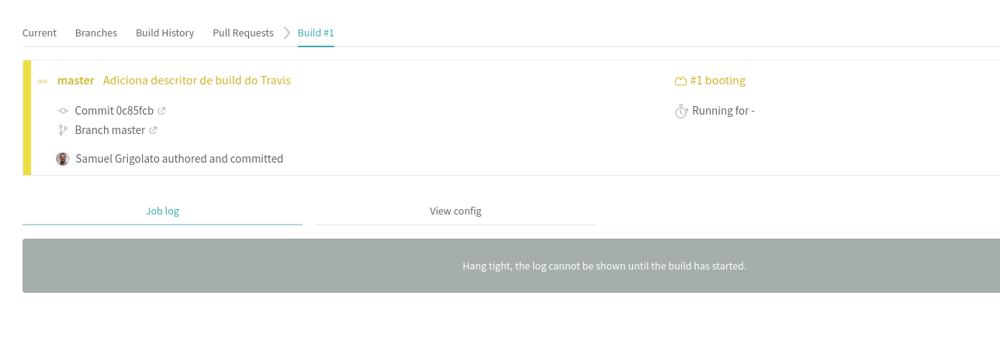
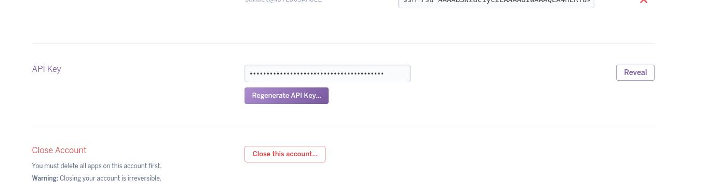
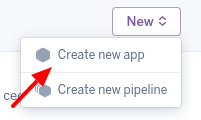

# Vamos falar sobre DevOps

Um software não presta para nada se ele não for usado por alguém, certo? E esse alguém
provavelmente não vai querer usar o tal software na nossa máquina. Um passo muito
importante em qualquer processo de desenvolvimento é a **implantação do software em
produção**. De maneira simplista podemos dizer que isso pode ser feito de duas maneiras:

1. Contratar uma equipe de operações: neste cenário, uma equipe fica responsável por
preparar os servidores de produção, subir os componentes da aplicação e mantê-los no ar.
2. Tornar a equipe de desenvolvimento responsável pelo ambiente de produção, efetivamente
transformando-a em uma equipe **DevOps**.

Hoje em dia muito se fala em **DevOps**, visto que os provedores de infraestrutura na
nuvem facilitaram muito a contratação de ambientes como serviço, permitindo que
desenvolvedores sem conhecimento de infraestrutura pudessem com razoável acertividade
configurar e manter ambientes no ar. De quebra, manter uma única equipe responsável
tanto pelo desenvolvimento quanto pela produção traz produtividade e rapidez na
resolução de defeitos e entrega de novas features.

Por isso, nesta trilha, veremos uma abordagem *DevOps* de implantação de sistemas,
com integração e entrega contínua. Nosso objetivo é ter dois ambientes, um de teste
(que chamaremos de *staging* à partir de agora), e um de produção. Esses ambientes
irão executar builds construídas à partir de branchs do repositório Git, respeitando o
seguinte mapeamento:

* O ambiente *staging* vai rodar uma build do commit mais recente da branch *staging*
* O ambiente *produção* vai rodar uma build do commit mais recente da branch *master*

Nota: uma maneira bem legal de adicionar segurança no processo de desenvolvimento é
*bloquear* o push direto nessas branches, permitindo apenas o merge através de
*merge request/pull request* e preferencialmente com aprovação de pelo menos 2
membros da equipe. Repositórios online como o GitLab, BitBucket etc fornecem esse
tipo de controle, mas nem sempre na versão aberta/gratuita.

Nosso primeiro passo então é fazer com que um push na branch *master* automaticamente
dispare uma build. Mas quem fará essa build? É aqui que entra a ferramenta de *CI* ou
ferramenta de *integração contínua*, sendo uma das mais conhecidas o *Jenkins*. No
nosso caso utilizaremos o **Travis CI**, por ser integrado ao *GitHub* e gratuito para
projetos de código aberto.

Nota: o restante deste tópico assume que o projeto no GitHub para a trilha foi
criado e ele contém o código produzido até agora.

Primeiramente acesse o site do [Travis CI](https://travis-ci.org/) e faça login com sua
conta GitHub. Uma vez logado na ferramenta, clique no botão "+" disponível no menu
lateral esquerdo. Nessa tela irão aparecer todos os seus projetos **públicos** no GitHub.
Clique no *switch* do lado do projeto criado para a trilha, de modo que ele fique verde.
Isso faz com que o Travis escute novos commits no repositório e dispare builds se
aplicável.

Não basta habilitarmos o projeto no site do Travis, precisamos também criar um arquivo
descritor de build, para dizer ao Travis como queremos que ele construa nosso projeto.
Esse arquivo é o `.travis.yml`, e deve ser criado na raíz do repositório com o seguinte
conteúdo:

```yaml
language: java
```

Só isso? Como nosso projeto usa ferramentas de build conhecidas, como o Gradle, não é
incomum encontrar serviços que são integrados a elas, como é o caso do Travis. Apenas
indicando para ele que nosso projeto é um projeto java, ele já identifica um projeto
Gradle e chama automaticamente a task `build`.

Nota para quem seguiu essa trilha presencialmente: no primeiro tópico, durante a criação
do projeto, utilizamos um repositório espelho do maven central, para evitar o download
das bibliotecas direto da Internet. É evidente que o Travis não tem acesso à rede local
onde esse espelho foi disponibilizado, logo temos que reverter isso no `build.gradle`,
apontando-o novamente para um repositório globalmente acessível:

```groovy
repositories {
    jcenter()
    // maven { url "http://192.168.1.7:8071/repository/maven-public/" }
}
```

Agora sim podemos efetuar commit e push, e aguardar a build ser disparada no Travis:



Neste ponto concluímos a parte de integração contínua da trilha. Note que fizemos apenas
um overview, sugere-se que o leitor aprofunde em tópicos como o funcionamento dos
testes automatizados na integração contínua, notificações por e-mail/Slack e outros
canais etc. Lembre-se que o principal objetivo da integração contínua é falhar builds
com erros e deixar passar apenas as builds com qualidade.

O segundo passo agora é criar os ambientes de *staging* e *produção*. Utilizaremos um
provedor de nuvem para nos ajudar, o *Heroku*. Primeiro crie uma conta no site deles.
Depois, na página inicial, clique no menu de sua conta (canto superior direito) e
selecione a opção `Account settings`. Na tela que aparecerá procure pelo campo
`API Key`:



Clique no botão `Reveal` para mostrar sua chave de API. Tome cuidado com esse valor,
*nunca* disponibilize-o publicamente, e isso inclui adicioná-lo em repositórios GitHub.
Se fizer isso por engano, acione a opção `Regenerate API Key` o mais rápido possível,
permitindo que o Heroku revogue o acesso da chave anterior.

Com sua API Key em mãos, crie um arquivo texto em algum lugar da sua máquina (fora do
repositório!) contendo essa chave. Atenção: use um editor de texto plano, como o notepad
do Windows ou o vi/vim/nano no Linux, não use editores de documento rico como o MS Word
ou Wordpad. Por quê? Para armazenarmos *seguramente* essa chave no nosso repositório
teremos que **criptografá-la**, e a criptografia não vai simplesmente ignorar espaços
em branco ou quebras de linha, o que acarretaria em um valor critografado que não
confere com sua chave de API, confundindo o Heroku que rejeitaria seu acesso.

Sempre que o material a seguir se referir ao arquivo `~/arquivo-com-api-key` considere
que a referência é para o arquivo criado acima.

Temos que de algum modo fornecer ao Travis *permissão* para solicitar ao *Heroku* que
suba novas versões de nossas aplicações. Como fazer isso? O Heroku fornece esse
mecanismo de *chave de API* como uma forma, mas como fornecer essa chave de API ao
Travis? Para isso existe o *Travis Secrets* que é uma forma de criptografar dados
no `.travis.yml` de forma que apenas o Travis consiga descriptografá-los.

Nota: não será explicado aqui pois foge do escopo dessa trilha, mas a técnica usada
pelo Travis é criptografia assimétrica onde o par de chaves é único para cada repositório
público do GitHub (isso evita que um valor criptografado seja usado em outros projetos).

Para criptografar nossa chave de API, precisamos do `Travis CLI` disponível na nossa
máquina. Essa ferramenta é um `gem` escrito em Ruby, portanto caso não tenha o
gerenciador de pacotes `RubyGems` na sua máquina agora é a hora para instalá-lo.
Instale o Travis CLI com o seguinte comando:

```
$ gem install travis
```

Depois de instalado, vá até o diretório raiz do projeto e execute o seguinte comando
para adicionar uma nova entrada no `.travis.yml` com o valor criptografado da sua
chave de API:

```
travis encrypt --add deploy.api-key < ~/arquivo-com-api-key
```

Nota: lembre-se de substituir `~/arquivo-com-api-key` pelo caminho relativo ou absoluto
onde colocou o arquivo de texto plano com a sua chave. Se o comando falhar em uma
linha solicitando que confirme a escolha de projeto GitHub, execute o seguinte comando:

```
travis encrypt --add deploy.api-key
```

Confirme a escolha do projeto, encerre a execução através de um `CTRL+C` e tente
novamente.

Depois do passo a passo acima o arquivo `.travis.yml` deve ficar parecido com:

```yaml
language: java
deploy:
  api-key:
    secure: D1QzHIegC........
```

Agora que adicionamos permissão para o Travis se passar por nós ao se comunicar com
o Heroku, vamos adicionar no arquivo `.travis.yml` diretivas para mapear `branches`
do repositório com `apps` Heroku:

```yaml
language: java
deploy:
  api-key:
    secure: D1......
  provider: heroku
  app:
    staging: suasiniciais-filmes-stg
    master: suasiniciais-filmes-prd
```

Note que adicionamos as chaves `provider` e `app` dentro do grupo `deploy`. Tome muito
cuidado com a identação, `YAML` é um formato muito rigoroso com relação a isso (por
exemplo, se não usar dois espaços em branco para identar blocos aninhados *não* vai
funcionar).

Lembre-se de trocar a expressão `suasiniciais` para um outro valor, pois as apps Herokus
compartilham um espaço de nomes global, portanto não vai funcionar se usar um nome de app
já existente.

Observe que o bloco `app` contém os *mapeamentos* de branchs para apps Heroku. Mas o que
isso quer dizer? Quer dizer que commits na branch *staging* irão disparar implantações
no app Heroku *suasiniciais-filmes-stg*, enquanto commits na branch *master* farão o
mesmo no app *suasiniciais-filmes-prd*. Repare que assim fica bem fácil criar processos
de desenvolvimento com *entrega contínua*, onde um simples pull request de *staging*
para *master* pode representar o deploy de uma nova versão em produção.

Note que neste ponto a configuração referente ao Travis está completa, mas ainda faltam
algumas coisas. Uma dessas é a criação em si dos aplicativos no Heroku. Vamos fazer isso.
Acesse sua conta Heroku, e clique no botão `New > Create new app` disponível no canto
superior direito:



Lembre-se de usar os mesmos nomes que estão no `.travis.yml`. Fora isso não há mais
nada a ser feito no Heroku. No entanto ainda não estamos prontos para subir o código
e testar nosso novo ambiente. O Heroku, diferentemente do Travis, *não* usa a task *build*
para construir projetos Gradle, mas sim ele busca por uma task chamada *stage*, que não
existe por padrão. Como não queremos efetuar nada em especial na build feita dentro
do Heroku, vamos apenas definir a task `stage` como um alias para a task `build`,
adicionando o seguinte bloco de código ao final do nosso arquivo `build.gradle`:

```groovy
task stage {
    dependsOn build
}
```

Além disso, o Heroku precisa de um arquivo chamado `Procfile` na raíz do repositório,
que serve como descritor para os *processos* que ele deve executar ao implantar a app.
O que seriam esses processos? No caso de aplicações java são os comandos do tipo
`java -jar xxxx` necessários para rodar um ambiente. No nosso caso, nosso Procfile precisa
apenas de uma entrada, que chamaremos de web, com o seguinte conteúdo:

```yaml
web: java -Dserver.port=$PORT $JAVA_OPTS -jar build/libs/XXXXXXX.jar
```

Substitua XXXXXXXX pelo nome do pacote Gradle. Se estiver em dúvida quanto a isso,
execute o comando `gradle build` na raíz do projeto, navegue até o diretório
`build/libs` e verifique o nome correto do artefato.

`java -jar XXXX.jar`? Sim, com o Spring Boot podemos criar os chamados JARs executáveis,
que sobem o servidor web *por dentro* (de maneira embarcada) ao invés de serem implantados
dentro de servidores web executados previamente. No entanto, a build padrão do Gradle não
gera um JAR executável, pois não contém os descritores necessários dentro do artefato
gerado. Para resolver isso precisamos adicionar o plugin do `Spring Boot` no nosso
`build.gradle` (faça isso no início do arquivo):

```groovy
plugins {
    id 'org.springframework.boot' version '1.5.7.RELEASE'
}

apply plugin: 'java'
apply plugin: 'idea'
```

Execute novamente o comando `gradle build` e volte a analisar o diretório `build/libs`.
Veja que agora existem dois artefatos, um `*.jar` e um `*.jar.original`. O primeiro é
o artefato processado pelo plugin do Spring Boot, executável, e o segundo é o artefato
original construído pela build padrão.

Agora estamos prontos para subir a build para o Heroku. Faça um commit, depois um push,
observe a build no Travis, e, se tudo der certo, acione a opção `Open App` na página
do app na sua conta Heroku:


Nota: pode ser necessário aguardar alguns minutos depois que a build no Travis concluir,
para dar tempo do aplicativo subir no Heroku. Repare que como não temos nada mapeado
para o caminho `/`, veremos um erro 404 do Spring Boot, o que está *correto* até agora.
Um teste melhor seria com a seguinte URL:
`https://{NOME_DA_APP}.herokuapp.com/filmes/em-exibicao`. Ex:
`https://suasiniciais-filmes-prd.herokuapp.com/filmes/em-exibicao`.

Aqui encerramos a parte de *DevOps*. Clique [aqui](07_swagger.md) para continuar.
