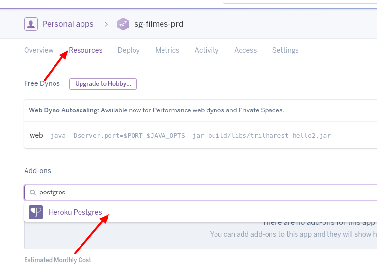

# Heroku Add-ons

Agora que estamos usando um banco de dados, nossos ambientes no Heroku quebraram. Isso
não deveria ser surpresa, pois não seria fácil para o Heroku ou qualquer outro provedor
identificar que queremos uma instância de postgres na nossa máquina e automaticamente
provisioná-la.

Então o que temos que fazer para nossa aplicação voltar a funcionar nos ambientes de
staging e produção? Se estivéssemos com um servidor físico ou uma máquina virtual
na nuvem, teríamos que conectar na máquina, instalar a base de dados, configurar diretivas
de segurança e ajustar a string de conexão JDBC que estamos usando. Como estamos usando um
PaaS, ele pode abstrair boa parte disso para nós, e a forma escolhida pelo Heroku para
fazer isso é a oferta dos `Heroku Add-ons`.

Os `Add-ons` Heroku são itens que você pode adicionar nas suas apps, que passam a ficar
disponíveis para todos os processos (ou dynos) da aplicação. Existem diversos add-ons
disponíveis, veja alguns exemplos interessantes:

* PostgreSQL
* MySQL
* Redis
* MongoDB
* New Relic APM
* SendGrid
* Elasticsearch
* RabbitMQ

A lista completa pode ser encontrada [aqui](https://elements.heroku.com/addons).

Para começar vamos adicionar o add-on `Heroku Postgres` nas nossas apps de staging e
produção. Para isso acesse seu dashboard, depois clique em alguma das apps, procure no
menu superior a aba `Resources`, dentro dela escreva `postgres` na caixa de busca da
seção `Add-ons` e clique em `Heroku Postgres` na lista suspensa:



Na caixa de dialógo que aparecerá acione a opção `Provision`.

Agora temos que dizer para nossa aplicação como deve fazer para se conectar ao banco
no Heroku. Olhando
[a documentação](https://devcenter.heroku.com/articles/heroku-postgresql) do add-on
Postgres, especificamente na seção *Connecting in Java*, vemos que o Heroku
disponibiliza uma *variável de ambiente* chamada `JDBC_DATABASE_URL`. Vamos então
no nosso `application.properties` fazer com que o spring olhe para essa variável
ao criar o data source JPA:

```yml
spring.datasource.url=${JDBC_DATABASE_URL}
```

Nota: as linhas com username e password não são mais necessárias, visto que o Heroku
vai adicionar essas informações na própria string de conexão JDBC.

Certo mas como faremos para testar localmente? Veremos algumas abordagens. A mais fácil
delas é adicionar uma variável de ambiente na configuração de execução na IDE. Use
este valor (ajustando usuário e senha se aplicável):

```
jdbc:postgresql://127.0.0.1/filmes?user=postgres&password=123456
```

Uma outra abordagem seria criar um `perfil` Spring para desenvolvimento (ou para
produção) e ativá-lo onde apropriado. Para isso, crie um arquivo chamado
`application-local.properties` do lado do arquivo existente `application.properties`:

```
spring.datasource.url=jdbc:postgresql://127.0.0.1/filmes
spring.datasource.username=postgres
spring.datasource.password=123456
```

Agora falta apenas *ativarmos* o perfil ao executar a aplicação. Fazemos isso enviando o seguinte parâmetro para a JVM (no IntelliJ IDEA fazemos isso editando o launch
configuration e adicionando o parâmetro no campo `VM options`):
`-Dspring.profiles.active=dev`.

Para verificar se a ativação do perfil deu certo, procure pela seguinte linha no começo
do log da aplicação:

```
2017-10-27 19:35:48.495  INFO 27952 --- [           main] c.o.trilharest.filmes.FilmesApplication  : The following profiles are active: dev
```

Agora já podemos commitar e dar push no nosso repositório e aguardar. Repare que como
estamos usando uma ferramenta de migração (o Liquibase) não precisamos nos preocupar
com restauração de backup nem nada do tipo!
